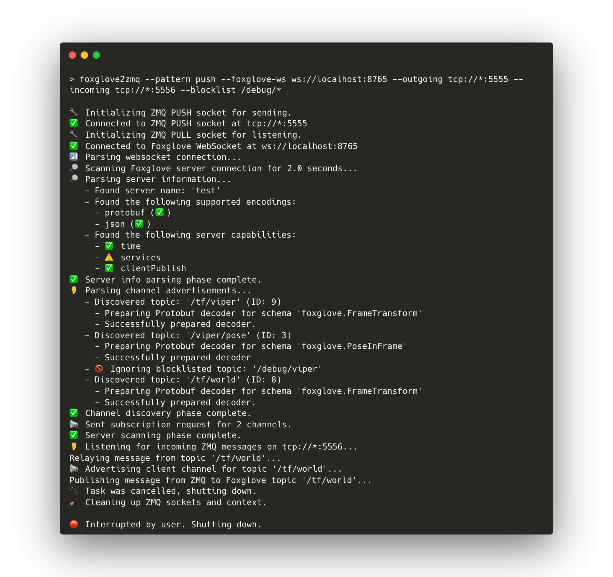

# Foxglove to ZMQ Relay

A Python utility to connect to a [Foxglove](https://foxglove.dev/) WebSocket server, decode messages (JSON and Protobuf),
and relay them to a ZMQ server using either a PUSH/PULL or PUB/SUB pattern.

This is useful for integrating Foxglove data streams with other backend services, logging systems, or robotics
frameworks that use ZMQ for messaging. Also includes a command-line interface (`foxglove2zmq`) for easy setup and
configuration!

## Features

* **Connects to any Foxglove WebSocket Server**: Natively connects using the `foxglove.sdk.v1` subprotocol.  
* **Automatic Channel Discovery**: Discovers all available channels on connect.  
* **Topic Filtering**: Easily blocklist topics you don't want to relay.  
* **Multi-Encoding Support**: Decodes both standard `json` and `protobuf` encoded messages on the fly.  
* **Dynamic Protobuf Decoding**: Parses Protobuf schemas
([`FileDescriptorSet`](https://protobuf.dev/programming-guides/techniques/#self-description)) provided by the server to
decode binary payloads into JSON.  
* **Flexible ZMQ Patterns**:  
  * `PUSH/PULL`: Relays all messages to a single stream for worker distribution.  
  * `PUB/SUB`: Publishes messages on their original Foxglove topic for selective subscription.  
* **Handles Large Messages**: Configured to accept WebSocket messages of any size.

### Todo

- [ ] Add support for bi-directional messaging with
[`ClientPublish` messages](https://docs.foxglove.dev/docs/sdk/websocket-server#handling-messages-from-the-app)
and [`Parameter` updates](https://docs.foxglove.dev/docs/visualization/panels/parameters).
- [ ] Add support for other [binary messages](https://github.com/foxglove/ws-protocol/blob/main/docs/spec.md#binary-messages):
  - [ ] `0x02` - Time
  - [ ] `0x03` - Service call responses
  - [ ] `0x04` - Fetch asset responses

## Installation

You can install the package from PyPI:

```bash
pip install foxglove-zmq-relay
```

Alternatively, you can install it directly from the GitHub repository:

```bash
pip install git+https://github.com/helkebir/foxglove-zmq-relay.git
```

## Usage

The relay is designed to be run as a standalone script. You can import and use the classes in your own applications.

### Command-Line Examples

A basic script is provided to run the relay from the command line. You can choose which ZMQ pattern to use. Currently,
the `PUSH/PULL` and `PUB/SUB` patterns are implemented.

A command-line interface is available via the `foxglove2zmq` command after installation.

```bash
foxglove2zmq --help
```

```
usage: foxglove2zmq [-h] -p {push,pub} [-w FOXGLOVE_WS] -z ZMQ_BIND [-v VERBOSITY] [-b [BLOCKLIST ...]] [--timeout TIMEOUT]

Relay Foxglove WebSocket messages to a ZMQ server.

optional arguments:
  -h, --help            show this help message and exit
  -p {push,pub}, --pattern {push,pub}
                        The ZMQ socket pattern to use ('push' for PUSH/PULL or 'pub' for PUB/SUB).
  -w FOXGLOVE_WS, --foxglove-ws FOXGLOVE_WS
                        The WebSocket URL of the Foxglove server (e.g., ws://localhost:8765).
  -z ZMQ_BIND, --zmq-bind ZMQ_BIND
                        The TCP address for the ZMQ server to bind to (e.g., tcp://localhost:5555).
  -v VERBOSITY, --verbosity VERBOSITY
                        The verbosity level (0 = errors only, 1 = info, 2 = debug).
  -b [BLOCKLIST ...], --blocklist [BLOCKLIST ...]
                        A space-separated list of topics to ignore (e.g., /diagnostics /debug).
  --timeout TIMEOUT     Time in seconds to wait for channel advertisements.
```

#### `PUSH/PULL` Relay

This is the simplest pattern. It sends all messages from all topics to any connected ZMQ `PULL` client.

```bash
# In one terminal, run the relay
foxglove2zmq --pattern push --foxglove-ws ws://localhost:8765 --zmq-bind tcp://localhost:5555
```

And in another terminal, run a ZMQ `PULL` client to receive messages:

```python
# ZMQ PULL client example (client.py)
import zmq
import json

context = zmq.Context()
socket = context.socket(zmq.PULL)
socket.connect("tcp://localhost:5555")

print("Receiving messages...")
while True:
    msg_str = socket.recv_string()
    msg_obj = json.loads(msg_str)
    print(json.dumps(msg_obj, indent=2))
```

#### `PUB/SUB` Relay

This pattern publishes each message on its original Foxglove topic. ZMQ `SUB` clients can then subscribe to specific topics.

```bash
# In one terminal, run the relay
foxglove2zmq --pattern pub --foxglove-ws ws://localhost:8765 --zmq-bind tcp://localhost:5555
````

And in another terminal, run a ZMQ `SUB` client to receive messages from a specific topic:

```python
# ZMQ SUB client example (client.py)
import zmq
import json

context = zmq.Context()
socket = context.socket(zmq.SUB)
socket.connect("tcp://localhost:5555")

# Subscribe to a specific topic (e.g., /sensor/camera)
# To subscribe to all topics, use b""
socket.setsockopt(zmq.SUBSCRIBE, b"/sensor/camera")

print("Receiving messages...")
while True:
    topic, msg_str = socket.recv_multipart()
    msg_obj = json.loads(msg_str)
    print(f"Topic: {topic.decode()}")
    print(json.dumps(msg_obj, indent=2))
```

### Library Usage

You can also import the classes into your own Python application for more advanced control.

```python
import asyncio
from foxglove2zmq import FoxgloveToZMQPushRelay, FoxgloveToZMQPubSubRelay

async def main():
    # Example for PUSH relay
    push_relay = FoxgloveToZMQPushRelay(
        foxglove_address="ws://localhost:8765",
        zmq_address="tcp://localhost:5555",
        topic_blocklist=["/diagnostics"],
        discovery_timeout=5.0
    )
    await push_relay.run()

if __name__ == "__main__":
    try:
        asyncio.run(main())
    except KeyboardInterrupt:
        print("Relay stopped by user.")
```

### Library Example

You can find example scripts in the `examples/` directory that demonstrate how to use the relay in different scenarios,
including both `PUSH/PULL` and `PUB/SUB` patterns. First install the package, then run the examples:

1. `zmq_relay.py`: A simple script to run the relay, must be run first. Defaults to `PUSH/PULL` mode on ZMQ bind `tcp://localhost:5555`.
2. `zmq_puller.py`: A ZMQ `PULL` client that connects to the relay and prints received messages.
3. `zmq_subber.py`: A ZMQ `SUB` client that connects to the relay and subscribes to all topics.

## **Project Structure**

```
foxglove2zmq/
├── foxglove2zmq/  
│   ├── __init__.py 
│   └── cli.py
│   └── relay.py
├── examples/
│   ├── zmq_puller.py 
│   └── zmq_relay.py
├── README.md
├── requirements.txt  
└── setup.py
```

## **License**

This project is licensed under the MIT License; see the [LICENSE]() file for details.